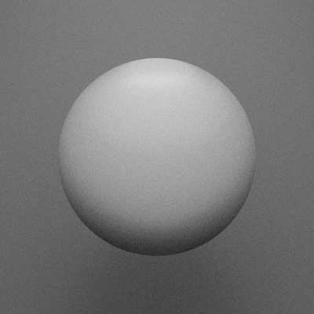
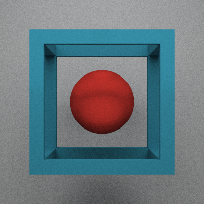
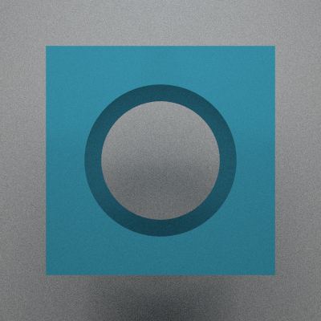

# easyshader


Drawing with easyshader is very simple.


```python
from easyshader import *

Sphere(1)
```


    

    


Use the "color" parameter to paint your object


```python
Icosahedron(1,'#f55')
```


    

    


# You can choose from the following primitives:

- Box
- BoxFrame
- Callable
- Cone
- Cyllinder
- Icosahedron
- Iterable
- Line
- Number
- Octahedron
- Shape
- Sphere
- Torus


```python
for obj in [Sphere(1), Cyllinder(1,1), Cone(1,2), Torus(1,.2), Box(1), BoxFrame(1,.1), Icosahedron(1), Octahedron(1)]:
    display(obj.paint('#0B4F6C'))
```


    

    


    

    


    

    


    

    


    

    


    

    


    

    


    

    


# Export your creations to polygon meshes for 3d printing or rendering on external apps (e.g. Blender)


```python
Icosahedron(1).to_mesh(simplify = 20, save_path='icosahedron.ply')
```


# Color your creations using functions defined over x,y,z and a color palette:


```python
palette = ['#B80C09','#0B4F6C','#01BAEF','#FBFBFF','#040F16']

x = Box(.9, 'palette(4*(x+y**2+z**3))', palette = palette)
x = x.isometric()
x
```


    

    


# Union:


```python
BoxFrame(1,.1,'#0B4F6C') + Sphere(.5,'#B80C09')
```


    

    


# Difference:


```python
Box(1,'#0B4F6C') - Sphere(1.2)
```


    

    


# Intersection:


```python
Icosahedron(1,'#0B4F6C') & Sphere(1.1)
```


    

    


## A coffee cup!


```python
x = Sphere(1, 'palette(6*(x+y+z))', palette = palette)
x = x.twist(4)

x &= Cyllinder(.5,.5)
x -= Cyllinder(.4,.5) + 'dy .1'
x += (Torus(.3,.05) & Shape('-x')) + 'dx .5'
x = x.isometric()
x += 'rx -pi/3'

x
```


    

    


# Create videos!
## Use the 't' (time) variable to control the animation


```python
x = Box(1,'palette(4*((x+sin(t))+(y+cos(t))**2+z**3))',palette = palette)
x += 'ry t'
x += 'rx t'

x.animate(frames = 60, framerate = 15, iterations = 20)
```


    Animating..: 100%|██████████| 59/59 [00:55<00:00,  1.07it/s]


    

    


```python

```
